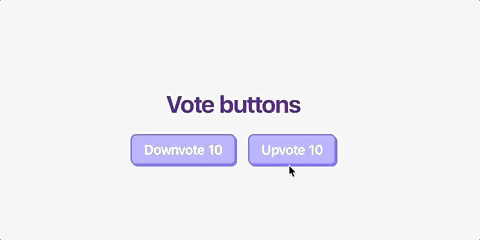
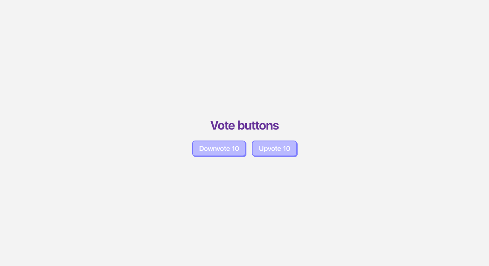

# Vote button

Let's create a `VoteButton` component.

The `VoteButton` component can be of two types: upvote or downvote.

The `VoteButton` component should have customizable text.

Each button should display a counter, counting the times it was clicked from its initial value.

On every click on the upvote button, its counter  should go up.

On ever click on the down button, its counter  should go down. Negative numbers are no allowed, so once the counter reaches 0, the counter should no longer be updated.

